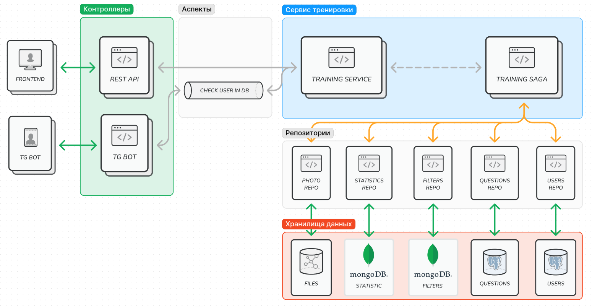

# Сервис тестом-тренажером АПО с REST API и Tg-ботом

Сервис с тренажером для подготовки к олимпиадам. Сервис имеет гексагональную архитектуру
с элементами аспектно-ориентированного программирования

## Требования к сервису

### 1. Сервис должен иметь общую логику для телеграм-бота и для REST API (и иметь возможность легко добавить новую платформу)

Для этого нужно разделить бизнес логику и слой представления. Для этого я создал `src/service` и `src/use_cases`. Также 
для единого языка общения реализованы модели данных в `src/models` для общения между слоями. Контроллеры между собой
полностью изолированы, что позволит запускать их в разных потоках/процессах

### 2. У сервиса архитектура должна располагать к свободному добавлению новых фичей и разграничению логики между ними

Поэтому в сервисе есть множество сценариев использования в `src/use_cases` такие, как: регистрация, тренировка,
получение статистики и тд. В каждом из сценариев будет различная реализация для телеграм бота и для REST API.
К ним через `IoC container` внедряются зависимости сервисов 

### 3. Сервис должен иметь высокую поддерживаемость кода. Код должен быть чистым и понятным

Для простоты сервис будет иметь модульную монолитную архитектуру. В дальнейшем с переходом на микросервисную 
(если будет несколько серверов и нагрузка)

Для чистоты кода использовались аспекты в `src/aspects`, для очистки кода в сервисах и контроллерах от кэширования,
логирования, проверки пользователя в БД и так далее

Также, благодаря паттерну репозиторий, можно продумать инфраструктуру, работу с сессиями и ORM, чтобы потом 
в сервисах можно было без проблем реализовывать бизнес логику. Репозитории пишутся однажды, а сервисы часто расширяются,
поэтому новичкам в проекте будет проще, по интерфейсу они будут понимать какие данные требуются и что возвращается

### 4. Сервис должен выдавать большое количество аналитических данных (дальше чем MVP)
- Для этого логи сервиса будут сохраняться в `ClickHouse` и визуализироваться в `Graphana`. 
- Также каждый вопрос хранит количество верных и общее количество ответов. 
- Все пользователи имеют дату регистрации и дату последнего использования

### 5. В сервис должно легко добавлять новые предметы
Для этого планирую написать отдельный веб сервис с валидацией базы тестов. 

Также в сервисе для каждого предмета есть схемы в `src/models`, что позволяет общаться с кафедрами на одном языке

# Реализация тренировки

Самого важного и сложного сценария использования

## Храненеие данных:
- Пользователи и задачи будут храниться в PostgreSQL,  
## Бизнес Логика (33%):
- [x] Регистрация (Bot) `нормально`
- [ ] Авторизация (API) `муторно`
- [x] Стартовая страница (Bot) `изи` 
- [ ] Тренировка (Bot) `долго` (Будет SAGA, очень много разных репозиториев, нужно следить за консистентность данных)
- [x] Тренировка (API) `изи` (изи т.к. SAGA готова)
- [ ] Личный кабинет `изи`
- [ ] Статистика `надо подумать`
- [ ] Фильтры `надо подумать`
- [ ] Админка: `долго`
  - [ ] Рассылка `сложно` (нужно делать ее быстро, но чтобы не блокировал telegram, а также в 3 интерфейсах)
  - [ ] Экспорт в xlsx `изи`
  - [ ] Создание ивентов `надо подумать`

## Инфраструктура (78%)
- [x] Pydantic Схемы `муторно`
- [x] DI контейнер `надо подумать`
- [x] Сервис пользователей `изи`
- [x] Аспекты (Bot) `надо подумать`
- [ ] Сервис статистики `норм`
- [ ] Сервис фильтров `норм`
- [x] Сервис тренировки `сложно`
- [x] SAGA для тренировки
- [x] Репозиторий для файлов
- [x] ORM `муторно`
- [x] Реализовать работу с сессиями (транзакции или UoW) `надо подумать`
- [ ] Добавить миграции `муторно`
- [x] Поднять PostgresSQL `изи`
- [x] Репозиторий для пользователей `норм`
- [x] Поднять MongoDB `изи`
- [x] Репозиторий для вопросов `норм`
- [x] Репозиторий для статистики `изи`
- [x] Репозиторий для фильтров `изи`
- [ ] Поднять Clickhouse `изи`
- [ ] Поднять Grafana `надо подумать`
